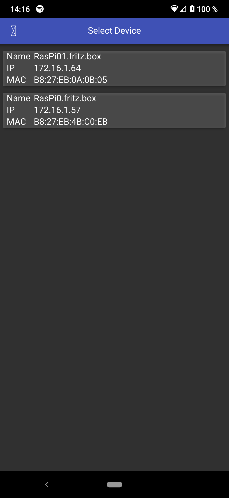

# LEDAmbiente

Android/Desktop GUI application to configure animations on SK6812 stripes 
controlled by a Raspberry Pi. 

See also https://github.com/kiozen/RasPiLEDControl

## Dependencies & Build System

* Qt 5.15.2 for Android (might even work with a lower version)

